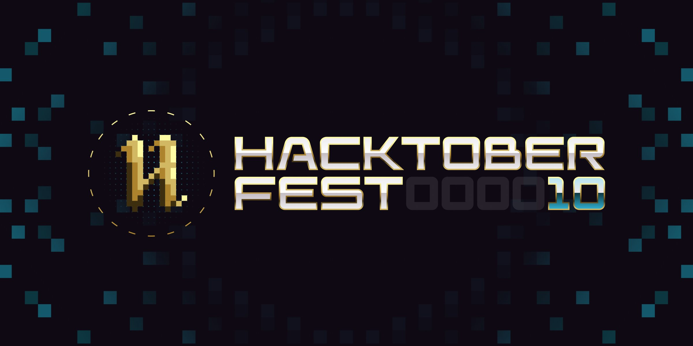

# DSA_CP_Hacktoberfest23

🚀 Join our Hacktoberfest 2023 DSA CP repo! Contribute DSA/CP problems with solutions &amp; theory explanations. Fork, create, commit, PR. Your expertise empowers learners! 
Welcome to our Hacktoberfest 2023 DSA CP repository! 🎉 We're excited to have you on board. 
 🗣 **Hacktoberfest 2023 encourages participation in the open-source community, which grows bigger every year.**

📢 **Register [here](https://hacktoberfest2023.digitalocean.com) for hacktoberfest2023 and make four pull requests (PRs) between October 1st-31st to grab free DIGITAL-SWAGS 🔥.**

# What Can You Contribute?

DSA/CP Questions and Solutions: Contribute your favorite Data Structures and Algorithms problems along with their solutions. Make sure to include the problem description and your code in a clear and readable format.

Theory Explanations: If you have in-depth knowledge about certain DSA/CP topics, share your insights! Write theory explanations for specific topics to help fellow learners grasp concepts better.

## Contributing

🎉 We welcome contributions from everyone, regardless of your experience level. Here are some ways you can contribute:

Do read the [Contribution Guidelines](/CONTRIBUTING.md)

- 🐞 Reporting issues
- 💡 Suggesting new features
- 📚 Improving documentation
- 🐛 Fixing bugs
- 💻 Adding new code

### Code of Conduct

Please read our [Code of Conduct](CODE_OF_CONDUCT.md) before participating in this project.

